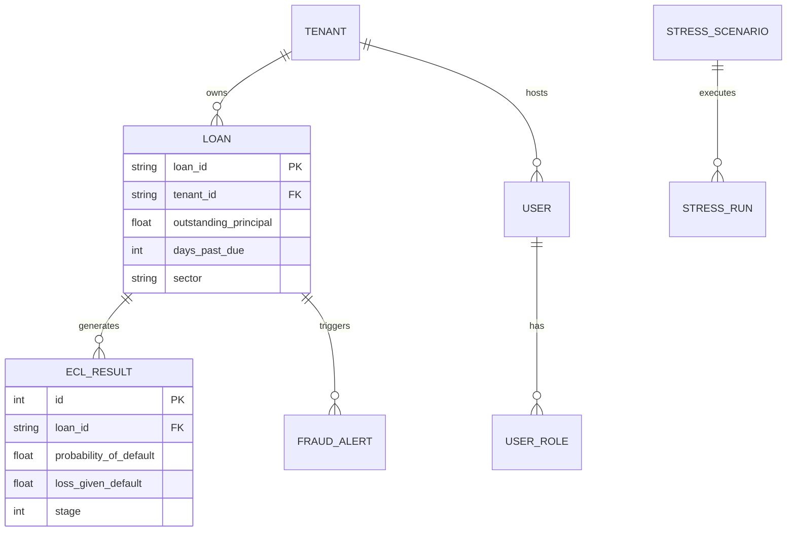

# ZIM RISK PLATFORM - Enterprise Risk OS v2.0.0

An enterprise-grade regulatory compliance and risk management platform tailored for the Zimbabwean financial sector. Designed for IFRS 9 ECL impairment modeling, Monte Carlo capital stress testing, and real-time fraud monitoring across multiple financial institutions.


---

## 🏛️ 1. System Architecture (The Modular Monolith)

Zim Risk Platform follows a **Modular Monolith (Flattened Standard)** approach, designed for maximum auditability and ease of use. All core operational logic is contained within singular root modules with a path to Kubernetes-based microservices.

### Backend (FastAPI + SQLAlchemy)
- `backend/app/models.py`: Centralized Master Schema (Identity, Risk, Fraud).
- `backend/services/`: Domain-driven service modules (Auth, ECL, Stress, Fraud, Reporting).
- `backend/app/main.py`: Enterprise entry point with RBAC middleware.

### Frontend (Next.js + Tailwind + D3.js)
- `frontend/src/components/`: Unified UI component library (Metrics, Charts, Tables).
- `frontend/src/pages/`: Modular page views including **Fraud Resonance Lab** and **Stress Lab**.

---

## 🔐 2. RBAC & Multi-Tenant Specification

To support the **Regulator (RBZ)** and individual **Bank Staff**, the platform implements a strict **Tenant-Based Resource Isolation** model.

### User Roles & Permissions
| Role | Responsibility | Primary Permission |
| :--- | :--- | :--- |
| **Admin** | System configuration | `admin.sys.manage` |
| **Risk Manager** | ECL & Stress Testing | `risk.ecl.execute` |
| **Compliance** | Fraud & STR Reporting | `fraud.str.submit` |
| **Regulator** | Cross-bank Visibility | `regulator.view.global` |

### Multi-Tenant Strategy
- **Shared DB, Shared Schema**: Federated data model using `tenant_id` partitioning.
- **Regulator Portal**: Unified oversight across all participating banks.
- **Audit Logging**: Every action is logged with institutional-level non-repudiation.

---

## 📊 3. Database Schema (Master ERD)

The platform utilizes a unified relational schema to ensure strong consistency for regulatory reporting.



---

## 🧠 4. ML Model Design (Actuarial Hub)

Zim Risk Platform utilizes a **Hybrid Actuarial-ML approach** for Expected Credit Loss (ECL).

| Pipeline | Model Type | Goal |
| :--- | :--- | :--- |
| **PD Engine** | XGBoost | 12-month and Lifetime Default Prediction |
| **LGD Engine** | Random Forest | Collateral haircut & Recovery Estimation |
| **EAD Engine** | Linear Curves | Forecast balance at moment of default |
| **Explainability** | SHAP | Auditable "Why?" for every calculation |

---

## 🛠️ 5. Quick Start & Infrastructure

### Launch Enterprise Stack (Docker)
1. **Initialize Core Services**:
   ```bash
   cd infrastructure/docker
   docker-compose -f docker-compose.enterprise.yml up --build
   ```
2. **Setup Initial Data**:
   ```bash
   cd backend
   $env:PYTHONPATH = "."; python seed.py
   ```

### Technical Stack
- **API**: FastAPI (Python 3.11)
- **Primary Data**: PostgreSQL 15 + TimescaleDB
- **Relationship Data**: Neo4j (Graph)
- **Message Bus**: RabbitMQ (Async Processing)
- **UI**: Next.js 14 + TailwindCSS

---

## 📜 6. Compliance Note
This platform is architected to exceed the disclosure requirements of **Statutory Instrument 142/2019** and the **IPEC IFRS 9** circular for risk reporting in the Zimbabwean financial ecosystem.
